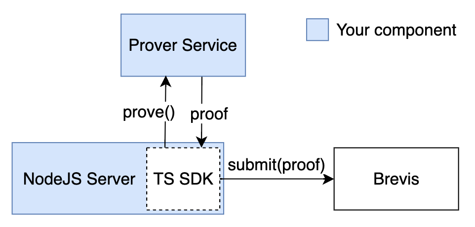

# Brevis SDK Typescript

The Typescript SDK offers a way for NodeJS to interact with the prover service and Brevis' system. Go check out Brevis SDK's [documentation site](https://docs.brevis.network/) for more information.

## Workflow



### Adding Data to Prove

#### Install the Dependency

```bash
npm install brevis-sdk-typescript
```

#### Initializing a Proof Request to Your Prover Service

```typescript
import { ProofRequest, Prover } from 'brevis-sdk-typescript';
// Assuming you started your prover service on port 33247, this is how you
// initialize a client in your NodeJS program to interact with it.
const prover = new Prover('localhost:33247');
const proofReq = new ProofRequest();
```

#### Adding Data to the Proof Request

Adding data is almost a one-to-one copy of how you would add data to prove in the Go SDK. The data you add here is closely tied to how you allocate data slots for your circuit and is available in CircuitInput passed in to your Define function.

```typescript
proofReq.addReceipt(
    new ReceiptData({
        tx_hash: '0x53b37ec7975d217295f4bdadf8043b261fc49dccc16da9b9fc8b9530845a5794',
        fields: [
            new Field({
                log_pos: 3,
                is_topic: false,
                field_index: 0,
            }),
            new Field({
                log_pos: 3,
                is_topic: true,
                field_index: 2,
            }),
            new Field({
                log_pos: 2,
                is_topic: true,
                field_index: 1,
            }),
        ],
    }),
);
```

#### Adding Custom Inputs

If you define custom inputs for your circuit, you need to fully assign them here in ProofRequest.

```typescript
// circuit custom input definition
type AppCircuit struct{
    // example custom field `MerkleProof`
    MerkleProof [8]sdk.Bytes32
}
// assigning custom input in typescript
proofReq.setCustomInput({
    // key names match what we defined in AppCircuit
    MerkleProof: [
        // type of the field should also match what we define in AppCircuit
        asBytes32('0x1111111111111111111111111111111111111111111111111111111111111111'),
        asBytes32('0x2222222222222222222222222222222222222222222222222222222222222222'),
        // ...
    ],
});
```

> The keys of the custom input object you add in typescript matches what you define in your app circuit. The first letter can also be lower cased, e.g. merkleProof in the above example
> Custom Input Types

> The types of the custom input you assign in ProofRequest must match what you define in your app circuit. All primitive circuit data types are allowed here through the following functions.

```typescript
proofReq.setCustomInput({
    myUint248Input1: asUint248('123'),
    // 0x prefixed hex input is also allowed
    myUint248Input2: asUint248('0xabcdef'),
    myUint521Input1: asUint521('123'),
    // 0x prefixed hex input is also allowed
    myUint521Input2: asUint521('0xabcdef'),
    myInt248Input: asInt248('-123'),
    myBytes32Input: asBytes32('0x3333333333333333333333333333333333333333333333333333333333333333'),
});
```

## Sending the Proof Request to Your Prover

```typescript
const proofRes = await prover.prove(proofReq);
```

#### Error handling

```typescript
if (proofRes.has_err) {
    const err = proofRes.err;
    switch (err.code) {
        case ErrCode.ERROR_INVALID_INPUT:
            console.error('invalid receipt/storage/transaction input:', err.msg);
            // handle invalid data input...
            // this error means some of your input
            // data (receipt/storage/transaction) is not found or not supported
            // e.g. you added a transaction of type other than 0 or 2,
            break;

        case ErrCode.ERROR_INVALID_CUSTOM_INPUT:
            console.error('invalid custom input:', err.msg);
            // handle invalid custom input assignment...
            break;

        case ErrCode.ERROR_FAILED_TO_PROVE:
            console.error('failed to prove:', err.msg);
            // handle failed to prove. usually marking some record as failed
            break;
    }
}
```

> If you receive ERROR_INVALID_INPUT, check your data against Limits and Performance to see if any data exceeds the limits.

> Tip: If you want to reuse the proofs you can do serialize and deserialize ProveResponse by:

```typescript
import { ProveResponse } from 'brevis-sdk-typescript';
const serialized = proofRes.serialize();
const restored = ProveResponse.deserialize(serialized);
```

## Sending Your Proof to Brevis

```typescript
import { Brevis } from 'brevis-sdk-typescript';

// A client for interacting with Brevis' systems
const brevis = new Brevis('appsdkv3.brevis.network:443');
// submit() takes
// the proof request
// proof response
// source chain ID where the data you want to use in your computation is from
// destination chain ID where your want to post the proof to
const brevisRes = await brevis.submit(proofReq, proofRes, 1, 11155111);

const id = brevisRes.id;
const fee = brevisRes.fee;
console.log(id, fee);
```

## Pay for Your Request on the Data Source Chain

Call `BrevisRequest.sendRequest()` with the ID acquired from `brevis.submit` and pay the fee in native token.

## Wait for Your App Contract to be Called

Since Brevis calls your app contract's callback function when the final proof is submitted, you can listen to your app contract's event. Or, you could use the built-in function to wait for final tx submission.
// wait() takes the request ID and a destination chain ID

```typescript
brevis.wait(brevisRes.id, 11155111);
```
